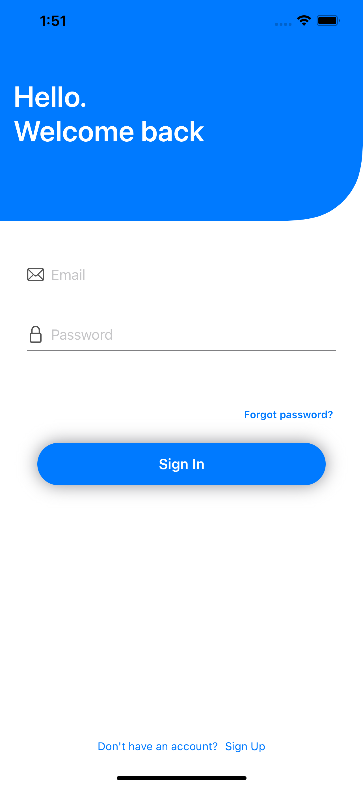
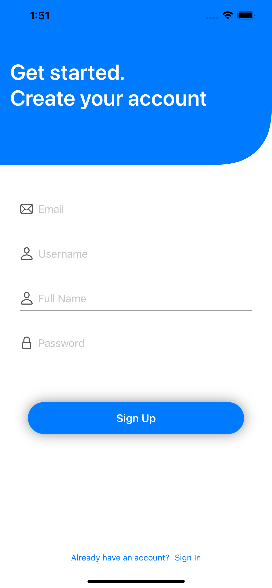
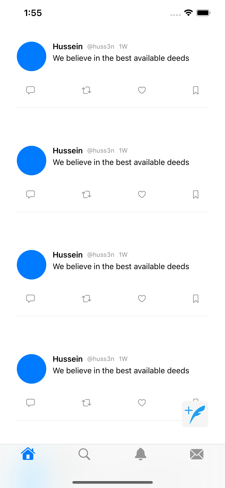

# TwitterClone

Trying to build twitter clone using swift ui as a learning point in my ios developer journey

The database i used is firebase to authenticate and register new useers

## Login screen

## Sign up screen

## Profile page 
<image src = "TwitterClone/scrnshots/profile.png" width = 400>

## Sample tweets view

The tweets is a list view that will be populated usind the twitter api
